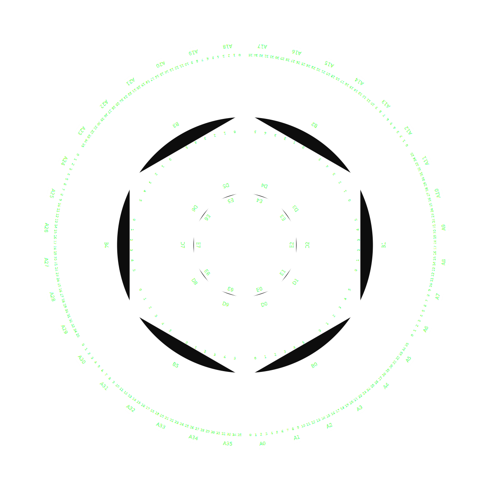

The Perceptron Apparatus is a 1.2 metre diameter wooden instrument with seven concentric rings of sliders. Each ring represents a layer in a simple neural network. You physically slide the rings to perform matrix multiplication and ReLU activation --- turning what's usually an invisible cascade of floating-point arithmetic into something you can see and touch.

## Where does the intelligence live?

Digital computers hide computation behind layers of abstraction. The apparatus does the opposite. It makes you do the work --- sliding rings, reading off values, carrying numbers forward through the network. You become the "human computer" in the neural network calculation.

This matters because it forces a strange question. If a neural network is intelligent, where does that intelligence reside? In the weights? In the architecture? In the person sliding the rings? The apparatus sits somewhere between a séance and a slide rule --- and that ambiguity is the point. AI is built on an ontology that separates mind from material reality. Making the computation physical and embodied exposes how odd that assumption really is.

## How it works

The seven concentric rings map directly onto a feedforward network: input, weights, hidden layer, more weights, and output. One ring is a logarithmic scale --- essentially a circular slide rule --- that handles the multiplications.

For MNIST digit recognition, you draw a digit on a worksheet, look up the corresponding weights on a reference poster, slide the rings, and read off the answer. The same apparatus also handles poker hand classification, encoding five-card hands as input features. Two very different domains, one shared physical form.

The fabrication files are generated programmatically in Elixir, producing SVGs for laser cutting and CNC routing. The trained weights get printed onto A3 reference posters and interactive worksheets. Fabrication support came from Sam Shellard at UC Workshop7.

Is it an abacus? Is it an ouija board? No --- it's a perceptron apparatus.
